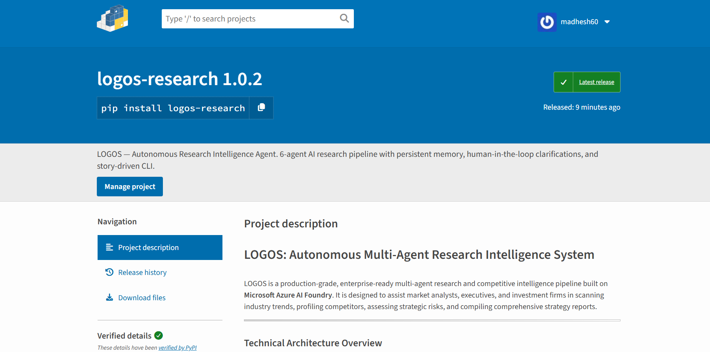

# LOGOS: Autonomous Multi-Agent Research Intelligence System

LOGOS is a production-grade, enterprise-ready multi-agent research and competitive intelligence pipeline built on **Microsoft Azure AI Foundry**. It is designed to assist market analysts, executives, and investment firms in scanning industry trends, profiling competitors, assessing strategic risks, and compiling comprehensive strategy reports.

---

## Technical Architecture Overview

LOGOS implements a sequential, context-accumulating multi-agent pipeline composed of six specialized reasoning agents. The system utilizes Microsoft Azure AI Foundry's model orchestration layer, stateful agent runtime, and Model Context Protocol (MCP) search tools to deliver highly grounded and cited analysis.

```
                         [ User Query / CLI / API ]
                                     │
                                     ▼
                      [ SQLite Persistent Memory Load ]
                                     │
                                     ▼
                    [ Human-in-the-Loop Clarification ]
                                     │
                                     ▼
                       [ Azure AI Foundry Workflow ]
                                     │
           ┌─────────────────────────┼─────────────────────────┐
           ▼                         ▼                         ▼
      Planner Agent           Researcher Agent        Industry News Scanner
      (GPT o4 Mini)            (GPT o4 Mini)            (GPT-4.1 Mini)
           │                         │                         │
           └─────────────────────────┼─────────────────────────┘
                                     │
                                     ▼
           ┌─────────────────────────┼─────────────────────────┐
           ▼                         ▼                         ▼
    Competitive Intel           Analyst Agent             Writer Agent
     (GPT-4.1 Mini)            (GPT-4.1 Mini)             (GPT-4.1)
           │                         │                         │
           └─────────────────────────┼─────────────────────────┘
                                     │
                                     ▼
                      [ SQLite Persistent Memory Sync ]
                                     │
                                     ▼
                           [ Final Strategy Report ]
```

---

## Core Features and Capabilities

*   **6-Agent Sequential Execution Pipeline**: Orchestrates distinct analytical stages from initial query decomposition to the final markdown report compilation.
*   **Dual Integration APIs**: Leverages the high-performance **Responses API** for visual-workflow-backed agents and the stateful **Agents Thread & Run API** for pre-deployed cloud assistants.
*   **Model Context Protocol (MCP) Grounding**: Integrates **Tavily Web Search** and **Azure AI Web Search (Bing)** to query real-time data indices without relying on static pre-training.
*   **Input & Output Guardrails**: Implements strict safety validation layers to redact sensitive personally identifiable information (PII) and ensure content compliance.
*   **Short-Term and Long-Term Memory**: Utilizes a persistent SQLite store (`memory.db`) to profile user preferences, track entity mention frequencies, and log past strategic insights.
*   **FastAPI REST API & Command-Line Interfaces**: Features a dual-interface delivery model (an interactive REPL CLI and a fully documented FastAPI backend).
*   **Azure Container Registry (ACR) Deployment**: Pre-configured container builds uploaded to the `reasoningagentregistry` for deployment on the stateful, hosted **Foundry Agent Service**.

---

## Agent Persona and Character Design

The system divides labor across six specialized agents, each fine-tuned with specific system instructions and model deployment targets:

1.  **Planner Agent** (`planner-agent`): Decomposes the primary business goal into structured sub-tasks. It estimates execution times and defines required tools.
2.  **Researcher Agent** (`researcher-agent`): Executes live searches via the MCP toolboxes to fetch verified data and source URLs.
3.  **Industry News Scanner** (`industry-news-trend-scanner`): Focuses on breaking developments and near-term market signals from the last 3-6 months.
4.  **Competitive Landscape Researcher** (`competitive-landscape-researcher`): Maps industry competitors, assesses market share, and identifies product differentiation gaps.
5.  **Analyst Agent** (`analyst-agent`): Performs qualitative analysis, categorizes evidence strength, and builds a probability-impact risk matrix.
6.  **Writer Agent** (`writer-agent`): Synthesizes the aggregated findings and drafts the final formal report using a standard corporate strategy template.

---

## Documentation Index

Detailed design specs, execution logs, and guides are organized within the `docs/` directory:

*   **[Agent Design and Multi-Agent Architecture](docs/agent.md)**: Breakdown of prompt structures, A2A communication, SQLite memory structures, and the HITL interface.
*   **[Hackathon Alignment and Requirements Mapping](docs/hackathonAlignment.md)**: Alignment matrices mapping how LOGOS emulates Work IQ, Foundry IQ, and Fabric IQ layers.
*   **[Developer Guide and Local Execution Manual](docs/developerGuide.md)**: Step-by-step setup guides for configuring virtual environments, `.env` parameters, and running CLI tests.
*   **[Microsoft Azure AI Foundry Usage Guide](docs/foundryUsage.md)**: Deep dive into Azure SDK project client calls, Responses API, Agents Thread API, and ACR deployment patterns.

---

## Quick Start & Installation

### Local Developer Installation

LOGOS can be installed in editable developer mode to modify source files:

```bash
# Clone the repository
git clone https://github.com/madhesh60/logos_reasoning_agent.git
cd logos_reasoning_agent

# Create and activate a virtual environment
python -m venv .venv
source .venv/bin/activate  # Windows: .venv\Scripts\activate

# Install dependencies and editable package
pip install -e .
pip install -e .[dev]
```

### CLI Command Execution

```bash
# Launch the interactive research shell (REPL)
logos

# Execute a query directly and save the report
logos -q "Evaluate the 2026 market prospects for hydrogen fuel cells."

# Bypass cloud API calls (Local Emulation Mode)
logos --no-a2a -q "Summarize advancements in solid-state batteries."

# Run a diagnostics check on model endpoints
logos --model-test
```

### Checking Agent Memory & Personalization

To view or print the agent's persisted memory database:
1. Launch the interactive shell:
   ```bash
   logos
   ```
   *(Or if running directly via python: `python logos/cli.py`)*
2. Once the greeting banner displays, type **`memory`** at the prompt:
   ```text
   > memory
   ```
   This prints a clean, beautifully formatted panel containing Personalization Details, Recent investigations history, and Frequently researched entities.
3. You can also view your bookmarked findings by typing:
   ```text
   > insights
   ```


### FastAPI Web Server Execution

```bash
# Launch the API server locally
uvicorn main:app --reload --port 8000
```
*   **Interactive Swagger UI**: [http://localhost:8000/docs](http://localhost:8000/docs)
*   **ReDoc Technical Specifications**: [http://localhost:8000/redoc](http://localhost:8000/redoc)

---

## Production Deployment Workflow

LOGOS is containerized and ready to be pushed to your cloud environment:

1.  **Build the Container Image**:
    ```bash
    docker build -t reasoningagentregistry.azurecr.io/logos-research-agent:latest .
    ```
2.  **Authenticate & Push to Azure Container Registry (`reasoningagentregistry`)**:
    ```bash
    az acr login --name reasoningagentregistry
    docker push reasoningagentregistry.azurecr.io/logos-research-agent:latest
    ```
3.  **Provision in Azure AI Foundry**:
    Deploy the pushed container image as a managed hosted agent within the **Foundry Agent Service**, attaching Managed Identities (Entra ID) for secure keyless access to Azure OpenAI and Azure Search endpoints.

---

## System Observability and Verification

LOGOS outputs structured JSON logging formatted by `structlog`, making it directly indexable by monitoring solutions like Azure Monitor and Application Insights.

Run the unit test suite to verify pipeline integrity:
```bash
pytest tests/test_agents.py -v
```

---

## Hackathon Proof & Verification

This section lists the system validation runs and screenshots showcasing the working state of the agent, its memory, traces, containerization, and security guardrails.

### 1. System Architecture

*Provides a high-level overview of the multi-agent orchestration pipeline, depicting how Planner, Researcher, Industry News Scanner, Competitive Intel, Analyst, and Writer agents cooperate and coordinate in a sequential pipeline.*

### 2. Conversation & Execution Trace

*A visual execution trace illustrating the active agent steps, agent-to-agent protocol exchanges, and LLM calls executed during a research session.*

### 3. User Personalization & Short-Term Memory

*Demonstrates the persistent SQLite memory layer. Type `memory` inside the interactive shell to review the customized profile, domain focus, and tracked research history.*

### 4. Running Container & Registry Deployment

*Confirms that the FastAPI service is containerized and pushed to the Azure Container Registry (`reasoningagentregistry.azurecr.io`), ready to be pulled by Azure AI Foundry Hosted Agent Services.*

### 5. Input and Output Security Guardrails


*Showcases active safety layers, demonstrating how toxic prompts, PII leaks, and blocked content are intercepted and sanitized in real-time.*

### 6. FoundryIQ - Project Knowledge Base

*Validates the connection of the multi-agent system to the project knowledge base, enabling the agents to query internal documentation and custom databases.*

### 7. Workflow Visualizer

*Displays the visual layout of the 6-agent sequential orchestration pattern as defined within the Azure AI Foundry playground.*

### 8. Python Package Installation (PyPI View)

*Confirms local installation verification as an editable Python package, showing successful dependency resolution and environment setup.*

### 9. Multi-Agent Setup

*Confirms the successfully configured Azure AI Foundry assistants, listing IDs and deployment specifications.*

---

## License

MIT License

Copyright (c) 2026

Permission is hereby granted, free of charge, to any person obtaining a copy
of this software and associated documentation files (the "Software"), to deal
in the Software without restriction, including without limitation the rights
to use, copy, modify, merge, publish, distribute, sublicense, and/or sell
copies of the Software, and to permit persons to whom the Software is
furnished to do so, subject to the following conditions:

The above copyright notice and this permission notice shall be included in all
copies or substantial portions of the Software.

THE SOFTWARE IS PROVIDED "AS IS", WITHOUT WARRANTY OF ANY KIND, EXPRESS OR
IMPLIED, INCLUDING BUT NOT LIMITED TO THE WARRANTIES OF MERCHANTABILITY,
FITNESS FOR A PARTICULAR PURPOSE AND NONINFRINGEMENT. IN NO EVENT SHALL THE
AUTHORS OR COPYRIGHT HOLDERS BE LIABLE FOR ANY CLAIM, DAMAGES OR OTHER
LIABILITY, WHETHER IN AN ACTION OF CONTRACT, TORT OR OTHERWISE, ARISING FROM,
OUT OF OR IN CONNECTION WITH THE SOFTWARE OR THE USE OR OTHER DEALINGS IN THE
SOFTWARE.
